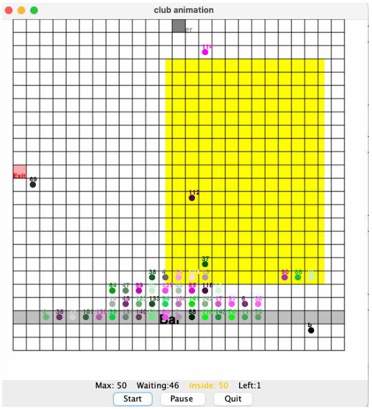

# Java Concurrent Club Simulation

A multithreaded Java application that simulates patron movement and interaction within a club, built to handle complex concurrency challenges like deadlocks, starvation, and race conditions. This project was developed to apply and master synchronization mechanisms in Java.

 !

---

### Key Concepts Demonstrated:
*   **Multithreading:** Each patron (`Clubgoer`) is simulated as an individual thread, allowing for concurrent actions and complex interactions.
*   **Synchronization:** Correctly implemented synchronization mechanisms to enforce club capacity rules, ensure safe access to shared resources (like doors and club grid), and prevent data corruption.
*   **Deadlock & Liveness:** Identified and resolved concurrency issues in the provided skeleton code. Implemented strategies like fair lock ordering to prevent deadlocks and ensure all threads make progress (liveness).
*   **Java Concurrency Utilities:**
    *   `ReentrantLock`: Used to manage exclusive access to grid blocks as patrons move around.
    *   `AtomicInteger`: Employed for thread-safe counting of patrons waiting, inside, and leaving the club, preventing race conditions.
    *   `synchronized` methods: Applied to ensure thread-safe initialization and access to shared data structures like `PeopleLocation`.
*   **Object-Oriented Programming:** The simulation is structured with 8 distinct classes, showcasing clear separation of concerns and object-oriented design principles.

---

### Core Challenges & Solutions:

1.  **Preventing Deadlocks:** The primary challenge was to ensure that no two patron threads would wait for each other indefinitely. This was solved by designing a consistent lock acquisition order and releasing locks promptly.
2.  **Ensuring Thread Safety:** Made critical shared resources (like the people counter and location map) thread-safe using Java's atomic variables and synchronized methods, eliminating potential race conditions from the original code.
3.  **Managing Club Capacity:** Used locks and signaling (`notifyAll()`) to make patrons wait when the club was full or the entrance was occupied, and efficiently notified them when space became available.

---

### How to Compile and Run:

1.  **Prerequisites:** Requires Java Development Kit (JDK) 8 or later.
2.  **Compile:**
    ```bash
    javac *.java
    ```
3.  **Run:**
    ```bash
    java ClubSimulation
    ```